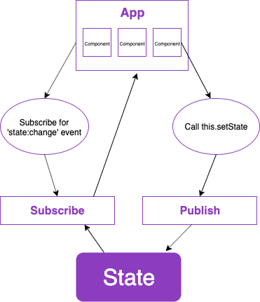

# Digital Bank Savings

This is the front-end part from my Digital Bank Savings application. I chose to use a react-like approach, but using vanilla JS, where every component has it's own responsabilities and share state between each other.
Thinking about escalability, mantainability and mainly reuse, I chose to keep all the business logic apart in a serverless API, so all possible applications could consume from only one source.

## Production

You can see this project in production by pasting the below url into your favorite browser or just click [here](https://nubank-challenge-front.s3.amazonaws.com/index.html)


## Instructions to run the project locally

1. Install the dependencies running
  - `npm install`

2. To start the server, run
  - `npm start`

3. This will build up a server on port 9001, so you only have to paste this into your favorite browser
  - `http://localhost:9000`

4. You must have serverless running on port `:2107`

**The instructions to run the serverless API are on `../api/README.md`**


## Testing

1. To run unit tests, simple past this into your command line
  - `npm run test:unit`

2. To run visual tests, run this
  - `npm run test:views`

4. To see test coverage, run this one
  - `npm run test:coverage`

## Project Structure

```
├── README.md
├── config
├── dist
├── package-lock.json
├── package.json
├── postcss.config.js
├── public
└── src
```

- **config**: where all the webpack and environment config goes.
- **dist**: receives all files generated from `npm run build`. Also it is from where _webpack-dev-server_ gets it's content to serve.
- **public**: where the production bundles and files goes after build.
- **src**: the source of the code.

## Project Achitecture


